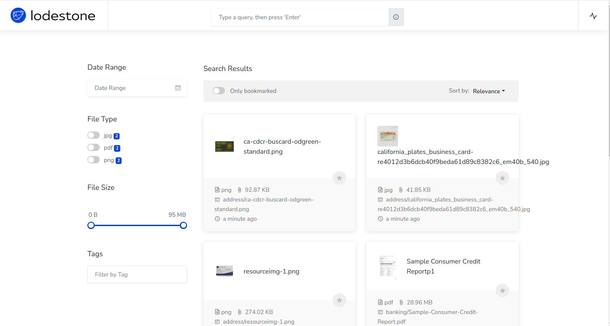

# lodestone
文档全文检索
# 原始项目
[lodestone](https://github.com/LodestoneHQ/lodestone)
# 改动
原始项目已经几年不更新了，项目全部迁移到go mod模式，重写了backend，全部用gin实现
# 运行
```sh
docker-compose up
```
# 访问
在浏览器输入http://ip/web 即可进行文档的查询搜索
# 如何添加文档
在挂载的目录进行文件粘贴复制，即可进行新增文件检测，文件处理完毕后即可在网页进行全局查询搜索
# 为什么有这个项目
最近有个需求，客户上传的文档有office、pdf、图片等等，未做任何文件分类，如果人肉去实现，就废了，因此有了这个项目！
目前已经实现常见的文档进行全文检索，图片ocr识别
# 预览图

